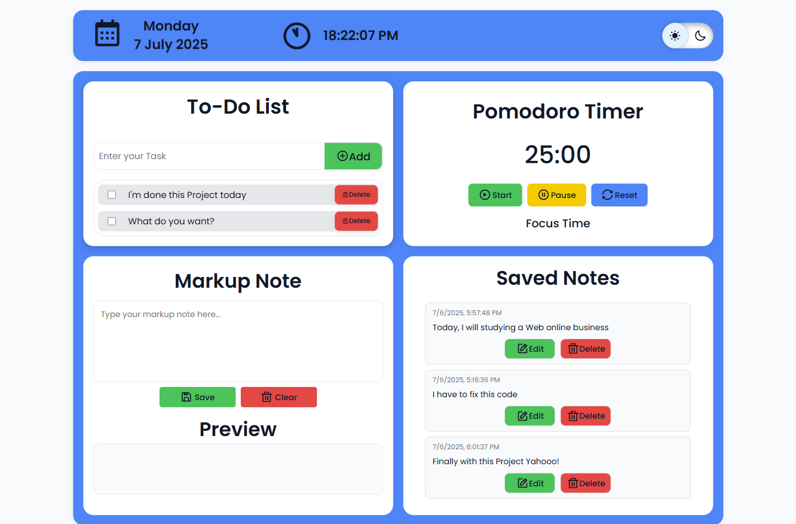
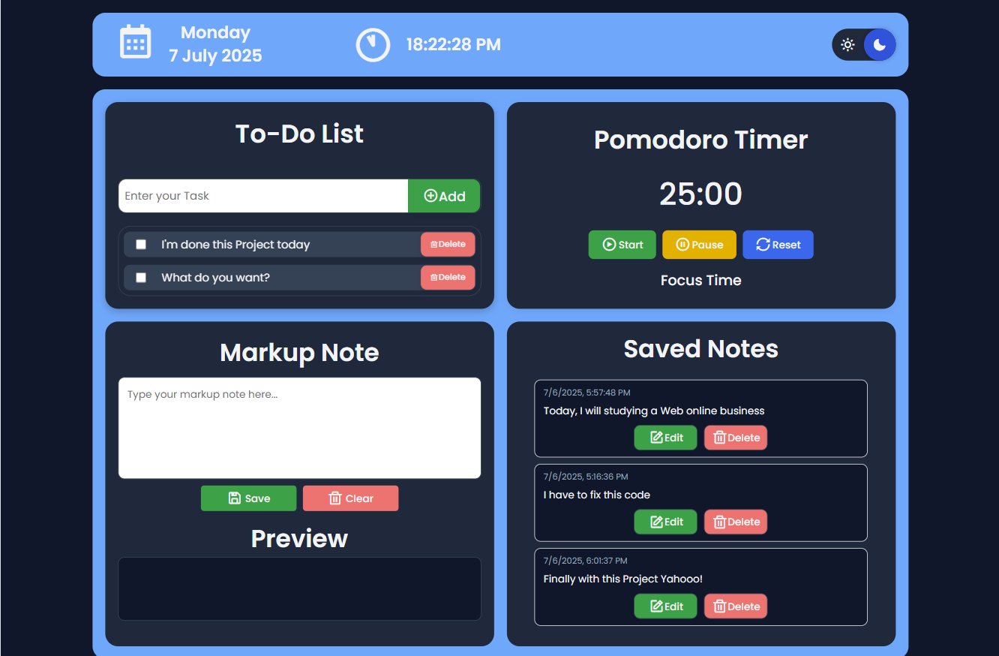

# 🌟 Personal Productivity Dashboard

A modern, minimal, and responsive personal dashboard that helps you manage your tasks, time, and notes in one place. This project is built using pure HTML, CSS, and JavaScript — no frameworks, no libraries, just clean and efficient code.

> ✅ To-Do List | ⏰ Pomodoro Timer | 📝 Markup Note Editor | 🌗 Dark/Light Theme Switcher

---

## 📷 Preview

### ☀️ Light Mode

### 🌙 Dark Mode

---

## 🚀 Features

### ✅ To-Do List
- Add, mark complete, and delete tasks.
- Smooth animation and intuitive interactions.
- Stored in localStorage for persistence.

### ⏰ Pomodoro Timer
- Focus Timer: 25 minutes, with optional long/short breaks.
- Start / Pause / Reset control buttons.
- Real-time display and status updates.

### 📝 Markup Note Editor
- Write notes using simple Markdown syntax.
- Live preview rendering.
- Save, edit, and delete notes (stored in localStorage).

### 🌗 Dark / Light Theme Switcher
- Toggle between light and dark mode with smooth transitions.
- Remembers your selected theme using localStorage.

---

## 💻 Technologies Used
- HTML5 + CSS3 (Flexbox + Grid)
- Vanilla JavaScript
- LocalStorage (for storing todos and notes)

---

## 📂 Folder Structure

